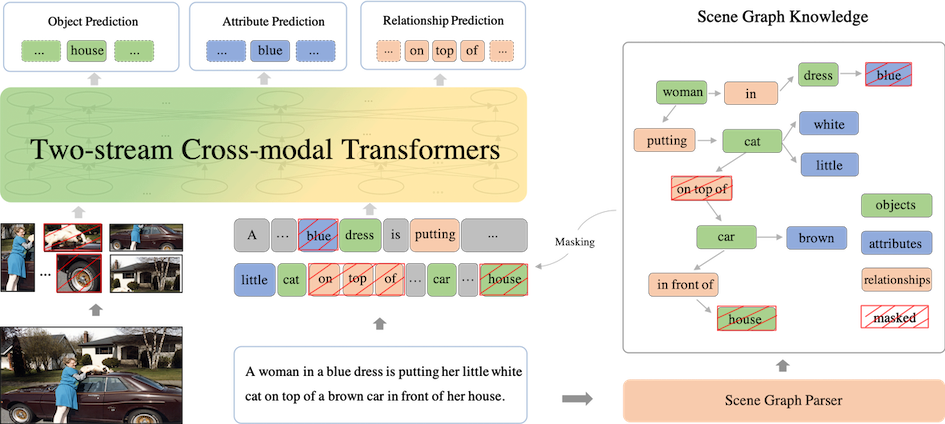

## Requirements
  ```script
   #train A100-40G cuda11.0 cudnn8.0.4 python 3.7
   #test RTX3090-24G cuda11.1 cudnn8.0.4 python 3.7
   nltk==3.2.4
   numpy==1.21.6
   scipy==1.2.1
   six==1.16.0
   json_lines==0.5.0
   lmdb==0.97
   opencv-python==3.4.2.17
   paddlepaddle-gpu==2.3.0rc0
   protobuf==3.20.0
  ```


## _ERNIE-ViL-PMR-Baseline_


关于算法的详细描述，请参见论文

>[_**ERNIE-ViL:Knowledge Enhanced Vision-Language Representations Through Scene Graph**_](https://arxiv.org/abs/2006.16934)
>
>Fei Yu\*, Jiji Tang\*, Weichong Yin, Yu Sun, Hao Tian, Hua Wu, Haifeng Wang (\* : equal contribution)
>
>Preprint June 2020
>


---
**ERNIE-ViL
是面向视觉-语言任务的知识增强预训练框架**，首次在视觉-语言预训练中引入了结构化的知识。ERNIE-ViL利用场景图中的结构化知识，构建了**物体预测，属性预测，关系预测**三种预训练任务，精细地刻画了视觉-语言模态之间细粒度语义的对齐，从而获得了更好的视觉-语言联合表示。

## 模型框架

基于文本中解析出的场景图，ERNIE-ViL提出了三个多模态场景图预测任务：
- **物体预测**：随机选取图中的一部分物体，然后对其在句子中对应的词进行掩码和预测；
- **属性预测**：对于场景图中的属性-物体组合，随机选取一部分词对其中属性词进行掩码和预测；
- **关系预测**：对于场景图中的物体-关系-物体三元组，对其中的关系词进行掩码和预测。



ERNIE-ViL 场景图预训练任务结构


## 下游任务：Premise-based Multimodal Reasoning

Premise-based Multi-modal Reasoning(PMR) is a task that the inference model should be able to reason with both textual (from the premise) and visual(from images) clues.

关于数据集的详细描述，请参见论文

>[_**Premise-based Multimodal Reasoning: Conditional Inference on Joint Textual and Visual Clues**_](https://arxiv.org/abs/2105.07122)
>
>Qingxiu Dong, Ziwei Qin, Heming Xia, Tian Feng, Shoujie Tong, Haoran Meng, Lin Xu, Weidong Zhan, Sujian Li, Zhongyu Wei, Tianyu Liu, Zuifang Sui
>
>ACL 2022 Main conference (Long Paper)
>


### 初始化
下载链接
  ```script
    https://pan.baidu.com/s/1TZvqo_ZJmKVQk0-rILt9lg 提取码:k8w3
  ```
- 将PMR.tar放于./data文件夹下解压
- 将ernie_large文件夹下载至项目根目录下
- 执行下列指令并将step_13320放在./PMR/output_pmr_tv文件夹下
```script
mkdir -pv PMR/output_pmr_tv
mkdir -pv PMR/result_pmr_tv
```
数据文件目录如下所示
```script
.
├── data
│   ├── PMR
│   └── unisex_names_table.csv
├── ernie-large
├── finetune.py
├── PMR
│   ├── output_pmr_tv
│   └── result_pmr_tv
```


### 预测
基于已经训练的模型，您可以通过下面的命令测试PMR的效果（相关的配置文件可以从之前下载的包获得）
 
  ```script
     python finetune.py
     --use_cuda True  --use_fast_executor true  --batch_size 48 --do_train False --do_test True --task_name pmr --test_split test --vocab_path ernie-large/vocab.txt --task_group_json ./conf/pmr/test_pmr.json 
     --init_checkpoint ./PMR/output_pmr_tv/step_13320 --ernie_config_path ernie-large/ernie_vil.large.json   --max_seq_len 50 --skip_steps 10 --result_file ./PMR/result_pmr_test/13320.txt
  ```
完成后运行根目录下read_txt.py生成规范格式预测文件*test_ori_without_label_result.jsonl*
### 训练
使用Bottom-Up-Attention生成图片特征后，使用下面的指令进行PMR任务的训练
 
  ```script
     python finetune.py
     --use_cuda True --is_distributed False --use_fast_executor true --nccl_comm_num 1 --batch_size 48 --do_train True --do_test False --task_name pmr --vocab_path ernie-large/vocab.txt --task_group_json ./conf/pmr/task_pmr.json --lr_scheduler manual_warmup_decay --decay_steps 13308;19962 --lr_decay_ratio 0.1 
     --layer_decay_rate 0.0 --text_init_layers 18 --n_layers 30 --margin 0.3 --num_train_steps 26640 --checkpoints ./PMR/output_pmr_ot --save_steps 3330 --init_checkpoint ernie-large/params --ernie_config_path ernie-large/ernie_vil.large.json --learning_rate 2e-5 --warmup_steps 6654 --weight_decay 0.01 --max_seq_len 50
  ```

